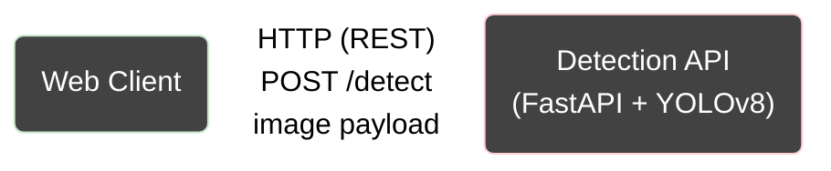

# Project Details
This project will demonstrate a cloud deployed perception system in which a web-based client interacts with a containerized object detection service. The emphasis is on infrastructure design and deployment practices, using containerization to package services and CloudLab to simulate a realistic distributed environment.

# Visual

# Proposal
The web client will be containerized using a Node.js base image (e.g., node:20-alpine) to serve the frontend assets. The detection service will be implemented using FastAPI and containerized with a python base image (e.g., python:3.11-slim) and Uvicorn as the application server. Docker will be used for building and running containers during development, and the services will be deployed on a separate CloudLab Nodes to simulate a realistic multi-component cloud environment. The detection API will be exposed over HTTP, and the web client will communicate with it using REST requests.
