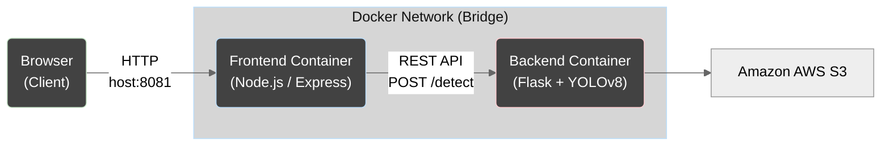

# YoloV8 Demo

This project will demonstrate a cloud deployed perception system in which a web-based client interacts with a containerized object detection service. The emphasis is on infrastructure design and deployment practices, using containerization to package services and CloudLab to simulate a realistic distributed environment.

## Visual

```mermaid
---
config:
  theme: neutral
---
flowchart LR
 subgraph DN["Docker Network (Bridge)"]
        B("Frontend Container<br>(Node.js / Express)")
        C("Backend Container<br>(Flask + YOLOv8)")
  end
    A("Browser<br>(Client)") -- HTTP<br>host:8081 --> B
    B -- REST API<br>POST /detect --> C
    C --> n1["Amazon AWS S3"]

    n1@{ shape: rect}
    style B color:#FFFFFF,fill:#424242,stroke:#BBDEFB
    style C color:#FFFFFF,fill:#424242,stroke:#FFCDD2
    style A color:#FFFFFF,fill:#424242,stroke:#C8E6C9
    style DN color:#111111,fill:#D6D6D6,stroke:#BBDEFB
```

## Proposal
The web client will be containerized using a Node.js base image (node:18-alpine) to serve the frontend assets through an Express server. The detection service will be implemented using Flask and containerized with a python base image (python:3.10-slim). The backend will use the YOLOv8 model to process images and return detected results.

Docker will be used for building and running containers during development, and the services will be deployed on a separate CloudLab Nodes to simulate a realistic multi-component cloud environment. The detection API will be exposed over HTTP on port 5002, and the web client will communicate with it using REST requests (POST /detect) by sending image data and recieving processed images in response.

## Project Structure

```text
csc468project/
├── .github/
│   └── workflows/
│       └── publish.yml
│
├── frontend/
│   ├── Dockerfile
│   ├── server.js
│   ├── yolo.js
│   ├── index.html
│   ├── gallery.html
│   ├── upload.html
│   ├── style.css
│   └── package.json
│
├── yolov8/
│   ├── Dockerfile
│   ├── app.py
│   ├── requirements.txt
│   └── yolov8m.pt
│
├── docker-compose.yml
├── docker-compose.images.yml
├── profile.py
└── README.md
```

## Overview

## Getting Started

First you want to start your CloudLab experiment by instantiating from the docker branch. Choose either Clemson or Wisconsin and leave everything else default. Once your experiment had booted up, ssh into your CloudLab node.

This project uses GitHub Actions for CI/CD. Instead of using the default GitHub-hosted runner, I configured a self-hosted runner on my CloudLab node. This allowed the repository workflow to build and push the project’s Docker images directly from the CloudLab environment.

Once in the CloudLab node:

### 1.) Download runner
```bash
# Create a folder
$ mkdir actions-runner && cd actions-runner# Download the latest runner package
$ curl -o actions-runner-linux-x64-2.334.0.tar.gz -L https://github.com/actions/runner/releases/download/v2.334.0/actions-runner-linux-x64-2.334.0.tar.gz# Optional: Validate the hash
$ echo "048024cd2c848eb6f14d5646d56c13a4def2ae7ee3ad12122bee960c56f3d271  actions-runner-linux-x64-2.334.0.tar.gz" | shasum -a 256 -c# Extract the installer
$ tar xzf ./actions-runner-linux-x64-2.334.0.tar.gz
```

### 2.) Configure
```bash
# Create the runner and start the configuration experience
$ ./config.sh --url https://github.com/zachdyszelwcu/csc468project --token <runner_token> # hit enter for all prompts
# Run it!
$ ./run.sh
```


## Backend
### Dockerfile
fill in here

## Frontend
### Dockerfile
fill in here

## Docker Compose
### Docker compose
fill in here
### Docker compose images
fill in here

## CD/CI
### Publish.yml
fill in here
