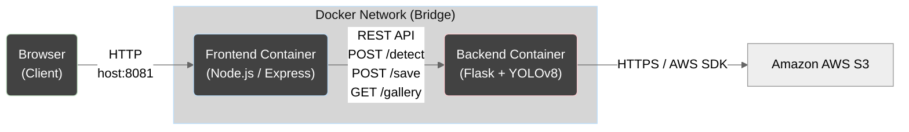

---

# YoloV8 Demo
This project will demonstrate a cloud deployed perception system in which a web-based client interacts with a containerized object detection service. The emphasis is on infrastructure design and deployment practices, using containerization to package services and CloudLab to simulate a realistic distributed environment.

---

## Visual

```mermaid
---
config:
  theme: neutral
---
flowchart LR
 subgraph DN["Docker Network (Bridge)"]
        B("Frontend Container<br>(Node.js / Express)")
        C("Backend Container<br>(Flask + YOLOv8)")
  end
    A("Browser<br>(Client)") -- HTTP<br>host:8081 --> B
    B -- REST API<br>POST /detect<br>POST /save<br>GET /gallery --> C
    C -- HTTPS / AWS SDK --> n1["Amazon AWS S3"]

    n1@{ shape: rect}
    style B color:#FFFFFF,fill:#424242,stroke:#BBDEFB
    style C color:#FFFFFF,fill:#424242,stroke:#FFCDD2
    style A color:#FFFFFF,fill:#424242,stroke:#C8E6C9
    style DN color:#111111,fill:#D6D6D6,stroke:#BBDEFB
```

---

## Proposal
The web client will be containerized using a Node.js base image (node:18-alpine) to serve the frontend assets through an Express server. The detection service will be implemented using Flask and containerized with a python base image (python:3.10-slim). The backend will use the YOLOv8 model to process images and return detected results.

Docker will be used for building and running containers during development, and the services will be deployed on a separate CloudLab Nodes to simulate a realistic multi-component cloud environment. The detection API will be exposed over HTTP on port 5002, and the web client will communicate with it using REST requests (POST /detect) by sending image data and recieving processed images in response.

---

## Project Structure

```text
csc468project/
├── .github/
│   └── workflows/
│       └── publish.yml
│
├── frontend/
│   ├── Dockerfile
│   ├── server.js
│   ├── yolo.js
│   ├── index.html
│   ├── gallery.html
│   ├── upload.html
│   ├── style.css
│   └── package.json
│
├── yolov8/
│   ├── Dockerfile
│   ├── app.py
│   ├── requirements.txt
│   └── yolov8m.pt
│
├── docker-compose.yml
├── docker-compose.images.yml
├── profile.py
└── README.md
```

---

## Overview

This project is a full stack containerized YOLOv8 object detection web application. The application allows a user to upload an image, send it to a Flask backend for object detection, view the detected result in the browser, and optionally save the image to an AWS S3 gallery.

The stack is split into two main custom services:

1. Node/Express Frontend
   - Serves the website pages.
   - Handles the upload interface, gallery interface, and frontend JavaScript.
   - Sends image data to the Flask backend through REST API requests.

2. Flask YOLOv8 Backend
   - Receives uploaded images from the frontend.
   - Runs YOLOv8 object detection on the image.
   - Returns an annotated image back to the frontend.
   - Saves detected images to AWS S3.
   - Retrieves gallery images from AWS S3.

The project is fully containerized using Docker and deployed on CloudLab. It also uses GitHub Actions for CI/CD, Docker Hub as the image registry, and a self-hosted GitHub Actions runner on CloudLab for live deployment updates.

## How the Components Communicate

The frontend and backend communicate using REST API requests over HTTP. The frontend serves the user interface on port 8081, but internally the Node/Express server runs on port 3000.

When a user uploads an image, the frontend JavaScript sends the image to the backend using a POST request to the /detect endpoint. The backend receives the image, runs YOLOv8 detection, and returns the annotated result as a JPEG image.

The frontend also communicates with the backend for gallery features:

- POST /detect sends an uploaded image to the backend for object detection.
- POST /save saves the most recently detected image to AWS S3.
- GET /gallery retrieves image URLs from the S3 bucket for the gallery page.

The Flask backend defines these routes directly in app.py, including /detect, /save, /gallery, and /upload. The backend runs on host 0.0.0.0 and port 5002, which allows it to accept traffic from outside the container.

---

# Technical Justification

## Why Node.js and Express?

The frontend uses Node.js with Express because the frontend needs a lightweight web server to serve the HTML, CSS, and JavaScript files. Express makes it simple to serve static files and listen for browser requests.

In this project, the Express server is intentionally simple. It does not run the object detection model. Instead, it focuses on serving the user interface and allowing the frontend JavaScript to communicate with the Flask backend.

This separation makes the design cleaner because the frontend and backend each have one main responsibility:

- The frontend handles the user interface.
- The backend handles machine learning inference and storage.

## Why Flask?

Flask was chosen for the backend because it is lightweight, flexible, and easy to connect with Python machine learning libraries. Since YOLOv8 runs in Python, Flask is a good choice for exposing the model through REST API endpoints.

The backend uses Flask to receive image uploads, process the image with YOLOv8, and return the annotated image to the frontend. It also uses boto3 to communicate with AWS S3 for saving and loading gallery images.

## Why YOLOv8?

YOLOv8 was chosen because it is a modern object detection model that can identify and label objects in images. This makes the project more interesting than a basic web app because it includes a real machine learning workload inside a containerized backend service.

## Why AWS S3?

AWS S3 is used as object storage for saved detection results. Instead of only storing images temporarily inside the container, the backend uploads saved images to an S3 bucket. This makes the gallery more realistic because it uses cloud storage instead of local container storage.

---

# Build Process

The project uses two custom Dockerfiles: one for the Flask YOLOv8 backend and one for the Node/Express frontend. Each Dockerfile builds a separate image for its part of the application. This keeps the project organized because the frontend and backend have different dependencies, different runtimes, and different responsibilities.

## Backend Build Process

The backend image is built from `python:3.10-slim`. I chose this base image because the backend is written in Python, but I still wanted the image to stay lightweight. The slim image includes the Python runtime without adding a lot of unnecessary system packages.

The Dockerfile sets `/app` as the working directory inside the container. This is where the backend application files are copied and where the Flask server runs from.

The backend build installs the system packages needed for YOLOv8 and OpenCV. These packages allow Python to process images correctly inside the container. It also installs `curl`, which is used to download the YOLOv8 model weights during the image build.

After the system packages are installed, the Dockerfile copies `requirements.txt` into the container and installs the Python dependencies. This includes the libraries needed for Flask, YOLOv8, OpenCV, CORS support, and AWS S3 access.

The Dockerfile then downloads the YOLOv8 model file into the container. This allows the backend to start with the model already available, instead of needing to download it every time the container runs.

After that, the rest of the backend files are copied into the container. This includes `app.py`, which contains the Flask routes for object detection, saving images, uploading images, and loading the gallery.

The backend Dockerfile also creates a non-root Linux user named `appuser` with user ID `1000`. Running the backend as a non-root user is a security best practice because the application does not need full root privileges to run. The Dockerfile also creates and gives permission to cache and configuration folders used by Python, PyTorch, YOLOv8, and Matplotlib.

Finally, the backend exposes port `5002` and starts the Flask application by running `app.py`.

## Frontend Build Process

The frontend image is built from `node:18-alpine`. I chose this image because the frontend server uses Node.js and Express, and Alpine keeps the image lightweight.

The Dockerfile sets `/app` as the working directory inside the container. It then copies the Node package files into the container and installs the dependencies listed in `package.json`.

After the dependencies are installed, the Dockerfile copies the frontend project files into the image. This includes the Express server file, the HTML pages, the CSS file, and the frontend JavaScript file.

The frontend container runs as the built-in non-root `node` user. This is another security improvement because the frontend web server does not need root permissions.

Finally, the frontend exposes port `3000` and starts the Express server by running `server.js`.

Overall, the build process creates two separate images:

- `zd991845/yolov8-flask:latest` for the Flask YOLOv8 backend.
- `zd991845/yolov8-frontend:latest` for the Node/Express frontend.

These images can be built locally during development or built automatically by the GitHub Actions pipeline and pushed to Docker Hub.

---

# Networking

Docker Compose creates a default bridge network for the stack. Both containers are attached to this network, which allows them to communicate with each other.

The two services are:

- frontend
- flask

Docker Compose provides internal DNS resolution by service name. This means one container can reach another container by using its service name instead of an IP address. For example, inside the Docker network, the backend service can be identified as flask.

The frontend is mapped like this:

    ports:
      - "8081:3000"

This means:

- Port 3000 is used inside the frontend container.
- Port 8081 is exposed on the CloudLab host.
- Users access the website through HOSTNAME:8081.

The backend is mapped like this:

    ports:
      - "5002:5002"

This means:

- Port 5002 is used inside the backend container.
- Port 5002 is exposed on the CloudLab host.
- The frontend can send requests to the backend on port 5002.

The frontend JavaScript builds the backend API URL by replacing the frontend port 8081 with the backend port 5002. This allows the same frontend code to work on different CloudLab hostnames without hard-coding one specific IP address or hostname.

---

# Docker Compose

Docker Compose is used to run the full application stack. Instead of starting each container manually, the Compose file defines both services and their settings in one place.

The stack has two main services:

1. `flask`
2. `frontend`

## Flask Backend Service

The `flask` service runs the YOLOv8 backend. It uses the custom backend image named `zd991845/yolov8-flask:latest`. The Compose file also includes the build context for the backend, which points to the `./yolov8` folder. This tells Docker where the backend Dockerfile and source code are located when the image is built locally.

The backend maps port `5002` on the host to port `5002` inside the container. This allows the frontend and browser to send requests to the Flask API.

The backend service also has `restart: always`, which means Docker will automatically restart the container if it stops unexpectedly. This makes the deployment more reliable.

The backend receives AWS configuration through environment variables. These variables include the S3 bucket name, AWS access key, AWS secret access key, and AWS region. The Flask application uses these values to connect to AWS S3 for saving detected images and loading gallery images.

The backend also includes several container security and resource settings. It drops all Linux capabilities, prevents new privileges, limits memory to `2g`, and limits CPU usage to `1.5` cores. These settings help prevent the backend from having more system access or resources than it needs.

## Frontend Service

The `frontend` service runs the Node/Express web server. It uses the custom frontend image named `zd991845/yolov8-frontend:latest`. The Compose file also includes the build context for the frontend, which points to the `./frontend` folder.

The frontend maps port `8081` on the CloudLab host to port `3000` inside the container. This means users access the website through `HOSTNAME:8081`, while the Express server still runs internally on port `3000`.

The frontend uses `depends_on` so Docker Compose starts the Flask backend before the frontend. This helps the frontend start after the backend service is created.

The frontend also uses `restart: always`, so it will restart automatically if the container stops.

For security, the frontend runs as a non-root user with user ID `1000`. It also drops all Linux capabilities and uses `no-new-privileges:true`. This limits what the frontend container can do at runtime.

For resource control, the frontend is limited to `512m` of memory and `0.5` CPU cores. Since the frontend only serves static files and handles simple Express routing, it does not need as many resources as the backend.

## Why Docker Compose Is Useful Here

Docker Compose is useful because it defines the whole stack in one file. It describes the images, ports, environment variables, security settings, restart policy, and resource limits for both services.

This also makes the project easier to deploy on CloudLab. Once the images are available from Docker Hub, the CloudLab node can pull the images and start the full stack with Docker Compose instead of manually building and running each container.

In this project, Docker Compose helps connect the frontend and backend into one working application while still keeping the services separated.

---

# Security Best Practices

This project uses several container security practices to reduce risk and follow a defense-in-depth approach. The goal is not just to make the application work, but to make sure the containers only have the permissions and resources they actually need.

## Non-Root Users

Both containers are designed to avoid running as root.

For the Flask backend, the Dockerfile creates a custom Linux user named `appuser` with user ID `1000`. The backend application then runs as this user instead of root. This is important because the backend runs YOLOv8, processes uploaded files, and connects to AWS S3. If something went wrong inside the backend container, running as a non-root user would limit what the process could access or modify.

For the frontend, the container runs as a non-root user as well. The frontend only needs to serve the website files and run the Express server, so it does not need root privileges.

Running as non-root is a basic but important container security practice because containers share the host kernel. If a containerized process is compromised, root access inside the container can create more risk than a restricted user.

## Dropping Linux Capabilities

The Docker Compose file drops all Linux capabilities for the services.

    cap_drop:
      - ALL

Linux capabilities are smaller pieces of root-level power. For example, some capabilities allow processes to change networking settings, mount filesystems, or perform other privileged operations.

This project does not need those abilities. The frontend only serves web files, and the backend only needs to run Python, process images, and respond to HTTP requests. Because of that, the containers drop all extra capabilities.

This follows the principle of least privilege: each container should only have the permissions it needs to do its job.

## No New Privileges

Both services use the `no-new-privileges` security option.

    security_opt:
      - no-new-privileges:true

This prevents a process inside the container from gaining additional privileges after it starts. Even if a program inside the container tried to use a privilege escalation method, this setting helps block it from receiving more permissions.

This is useful because it adds another layer of protection at runtime. Even though the containers already run as non-root users and drop capabilities, `no-new-privileges` gives an extra restriction in case something unexpected happens inside the container.

## Resource Limits

The Compose file also limits how much CPU and memory each container can use.

The backend uses:

    mem_limit: 2g
    cpus: "1.5"

The frontend uses:

    mem_limit: 512m
    cpus: "0.5"

These limits demonstrate cgroup-based resource control. Cgroups are a Linux feature that allow Docker to restrict how much CPU and memory a container can consume.

This matters because the backend runs YOLOv8, which is more resource-heavy than the frontend. Giving the backend more memory and CPU makes sense because object detection needs more processing power. The frontend only serves static files and handles lightweight Express routing, so it gets fewer resources.

Resource limits also protect the CloudLab node. If one container has a bug, infinite loop, or memory issue, it cannot consume all of the machine’s resources.

## Environment Variables and Secrets

The backend needs AWS information to connect to S3, but those values should not be hard-coded directly into the Python source code.

Instead, the application reads AWS information from environment variables:

    S3_BUCKET_NAME
    AWS_ACCESS_KEY_ID
    AWS_SECRET_ACCESS_KEY
    AWS_DEFAULT_REGION

This keeps the code more flexible and avoids placing credentials directly inside `app.py`.

In the deployment workflow, sensitive values are stored as GitHub Secrets. The GitHub Actions workflow can pass those values into the deployment environment without writing them directly into the public repository.

This is safer than committing credentials into source code because the repository can stay public without exposing AWS keys.

## Restart Policy

Both services use a restart policy:

    restart: always

This is more of a reliability setting than a strict security control, but it improves the deployment. If a container crashes or stops unexpectedly, Docker automatically restarts it.

For a CloudLab deployment, this helps keep the demo stable because the application can recover from simple container failures without needing to manually restart everything.

## Separation of Services

The project separates the frontend and backend into two containers instead of putting everything into one container.

This improves the design because each container has a clear responsibility:

- The frontend serves the user interface.
- The backend handles object detection and AWS S3 communication.

This also improves security. If one part of the application has a problem, it is more isolated from the other part. The frontend container does not need Python, YOLOv8, or AWS logic. The backend container does not need to serve all of the frontend files as its main job.

Keeping services separated makes the stack easier to manage, debug, secure, and scale.

## Overall Security Approach

The security design of this project follows defense in depth. Instead of relying on one security setting, the stack uses several layers:

- Containers run as non-root users.
- Linux capabilities are dropped.
- New privileges are blocked.
- CPU and memory are limited.
- AWS credentials are handled through environment variables and GitHub Secrets.
- Frontend and backend services are separated.
- Containers automatically restart if they fail.

These choices make the deployment safer and more professional while still keeping the project simple enough to run on CloudLab with Docker Compose.

---

# CI/CD Pipeline

This project uses GitHub Actions to create a CI/CD pipeline.

The pipeline has two main jobs:

1. Build and Push
2. Deploy on CloudLab

## Build and Push Job

When code is pushed to the main branch, GitHub Actions automatically builds the backend and frontend Docker images.

The workflow builds:

- zd991845/yolov8-flask:latest
- zd991845/yolov8-frontend:latest

After building the images, the workflow pushes them to Docker Hub.

This also makes CloudLab deployment cleaner because the CloudLab node can pull the latest images from Docker Hub instead of rebuilding them from source.

## Deployment Job

After the images are built and pushed, the deployment job runs on a self-hosted GitHub Actions runner installed on the CloudLab node.

The deployment job:

1. Checks out the repository.
2. Logs in to Docker Hub.
3. Pulls the newest images.
4. Restarts the containers with Docker Compose.
5. Removes old unused images.

This creates the full CI/CD loop. A push to GitHub can build the images, push them to Docker Hub, and update the running CloudLab deployment automatically.

---

# How to Launch the Stack on CloudLab

## 1. Start the CloudLab Experiment

First, start the CloudLab experiment using the project profile. After the experiment is ready, SSH into the CloudLab node.

    ssh USERNAME@HOSTNAME

## 2. Set Up the GitHub Actions Runner

On the CloudLab node, create a self-hosted GitHub Actions runner from the GitHub repository settings.

In GitHub, go to:

    Repository → Settings → Actions → Runners → New self-hosted runner

Select:

    Linux x64

Then follow the commands GitHub gives you to download, configure, and start the runner.

Once the runner is active, the deployment process happens automatically when the GitHub Actions workflow runs. The workflow builds the images, pushes them to Docker Hub, and updates the running containers on CloudLab.

## 3. Open the Website

After the workflow finishes, find the CloudLab hostname with:

    hostname -f

Then open the frontend in a browser using:

    http://HOSTNAME:8081

Replace HOSTNAME with the value returned by hostname -f.

---
