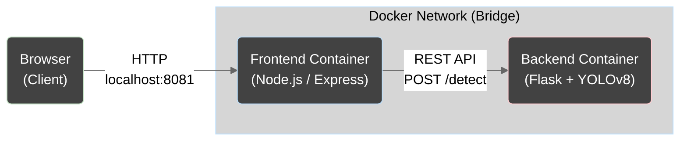

# Project Details
This project will demonstrate a cloud deployed perception system in which a web-based client interacts with a containerized object detection service. The emphasis is on infrastructure design and deployment practices, using containerization to package services and CloudLab to simulate a realistic distributed environment.

# Visual

```mermaid
---
config:
  theme: neutral
---
flowchart LR
  A("Browser<br/>(Client)") -->|"HTTP<br/>localhost:8081"| B("Frontend Container<br/>(Node.js / Express)")

  B -->|"REST API<br/>POST /detect"| C("Backend Container<br/>(Flask + YOLOv8)")

  subgraph DN["Docker Network (Bridge)"]
    B
    C
  end

  style DN color:#000000,fill:#D6D6D6,stroke:#BBDEFB
  style A color:#FFFFFF,fill:#424242,stroke:#C8E6C9
  style B color:#FFFFFF,fill:#424242,stroke:#BBDEFB
  style C color:#FFFFFF,fill:#424242,stroke:#FFCDD2
```

# Proposal
The web client will be containerized using a Node.js base image (node:18-alpine) to serve the frontend assets through an Express server. The detection service will be implemented using Flask and containerized with a python base image (python:3.10-slim). The backend will use the YOLOv8 model to process images and return detected results.

Docker will be used for building and running containers during development, and the services will be deployed on a separate CloudLab Nodes to simulate a realistic multi-component cloud environment. The detection API will be exposed over HTTP on port 5002, and the web client will communicate with it using REST requests (POST /detect) by sending image data and recieving processed images in response.

